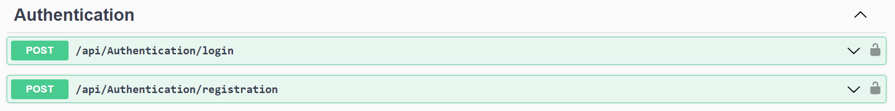
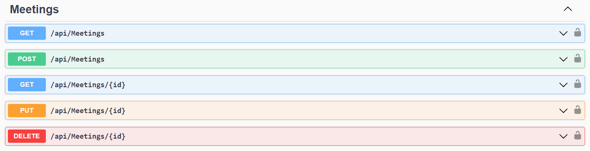
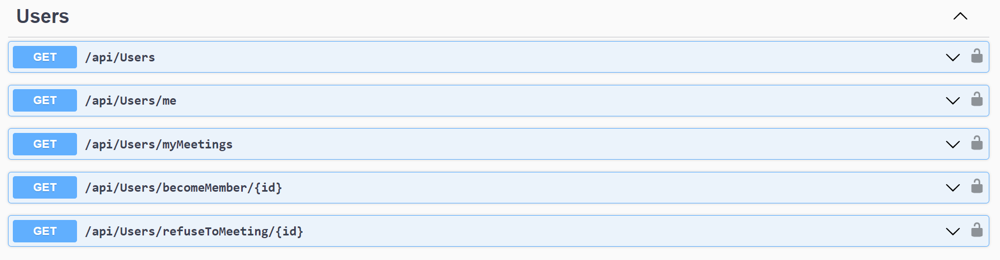

# Meetup Api

Meetup control api

- [Installation](#Installation)
- [About](#About)
- [Endpoints](#Endpoints)


## Installation

Clone this repository:

```bash
git clone https://github.com/kvtim/MeetupApi.git
```

Go to the folder with docker-compose:

```bash
cd Meetup
```

Run docker-compose:

```bash
docker-compose up
```

Go to this url:
https://localhost:5000/swagger/index.html


## About
N-layer architecture was used with postgres database, JWT authentication and patterns such as repository and unit of work.

There is a many-to-many relationship between the user and the appointment. Admin, owner, speaker, user are separated by roles.

 Admin and owner can manage meetups. Admin of all, the owner of only those in which he participates. Ordinary users can join existing events and refuse to participate in events.

Layers:
- Meetup.Api
- Meetup.Services
- Meetup.Data
- Meetup.Core


## Endpoints

- ### /Authentication 
    Authentication with JWT token
    


- ### /Meetings
    Meeting management (only the admin or owner of meetup can change and delete)
    

- ### /Users
    User management (users can view information about themselves and become participants in events.
    Admin can view information about all users)
    
